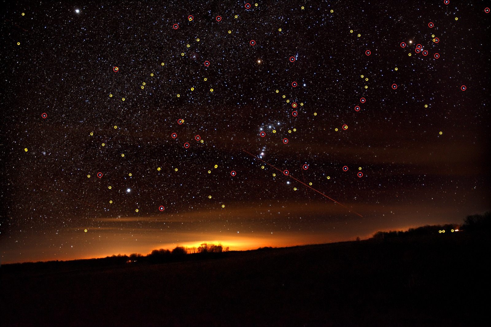

<div align="center">

# Offgrid
Doesn't matter if you're in the middle of the ocean, lost in a forest, in the middle of a natural disaster, or just somewhere cell towers don't reach, GPS can get jammed, towers go down in disasters, and most of the planet still has zero coverage. When that happens you lose two things at once: knowing where you are, and any way to tell someone.

AeroGaze fixes the first one, point your phone at the night sky and it works out your exact position, no satellites, no towers, no internet. Relay fixes the second problem, as it hands your message off to a nearby stranger's phone (encrypted, so they can't read it, and works kind of like Apple's Find My, but for messages), which passes it along until it reaches the internet, without ever being able to read it.



</div>

---

This repo has two separate, offline-first tools that deal with that, but to run it you can simply open either the android-app/ or the ios-app/ folder:

1. **AeroGaze** - Finds your exact latitude and longitude (coordinates) from a single photo of the night sky (uses stars/constellations), your phone's gravity sensor, and the current time. No GPS, no cell service, no Wi-Fi.
2. **Relay** — end-to-end encrypted messaging that hands your message to a nearby stranger's phone over Bluetooth/Wi-Fi Direct, which passes it on to the internet once it's back in range. All it ever sees is unreadable ciphertext.

---

## Project Structure

```
Offgrid/
├── aerogaze/          # Core celestial positioning engine (pure NumPy/SciPy)
├── android/           # Standalone Android app — Relay only
├── android-app/       # Unified Android app — AeroGaze (via Chaquopy) + Relay
├── ios/               # iOS app — Relay only (Swift, MultipeerConnectivity)
├── ios-app/           # Unified iOS app — AeroGaze (via Chaquopy) + Relay
├── server/              # Lightweight Python HTTP server for Relay
├── scripts/             # Demo & utility scripts (e.g. demo.py)
├── data/                  # Star catalogs + prebuilt quad-hash indices
├── quad/                 # Standalone quad-based star detection/solving utilities
├── tests/                 # pytest suite for the AeroGaze engine
└── requirements.txt
```


---

## 1. AeroGaze — Offline Celestial Positioning

AeroGaze basically uses star tracking, mixed with astronomical coordinate correction, to find your position from a night-sky photo with zero network dependency.

### How it works
1. **Capture** — take a photo of the night sky.
2. **Detect** — find the stars in the photo (`detect.py`).
3. **Pattern match** — group stars into "quads" and match them against a star catalog (`quadmobile.py` / `solve.py`).
---
## 2. Relay — Zero-Signal E2E Encrypted Messaging

Relay is basically Find My, but for messages. You send something with zero signal and your phone hands it to a nearby stranger's phone, which carries it along until it gets internet, without ever being able to read what's inside.

---


