<div align="center">

# Offgrid
Doesn't matter if you're in the middle of the ocean, lost in a forest, in the middle of a natural disaster, or just somewhere cell towers don't reach, GPS can get jammed, towers go down in disasters, and most of the planet still has zero coverage. When that happens you lose two things at once: knowing where you are, and any way to tell someone.

AeroGaze fixes the first one, point your phone at the night sky and it works out your exact position, no satellites, no towers, no internet. Relay fixes the second problem, as it hands your message off to a nearby stranger's phone (encrypted, so they can't read it, and works kind of like Apple's Find My, but for messages), which passes it along until it reaches the internet, without ever being able to read it.

<table>
  <tr>
    <td align="center">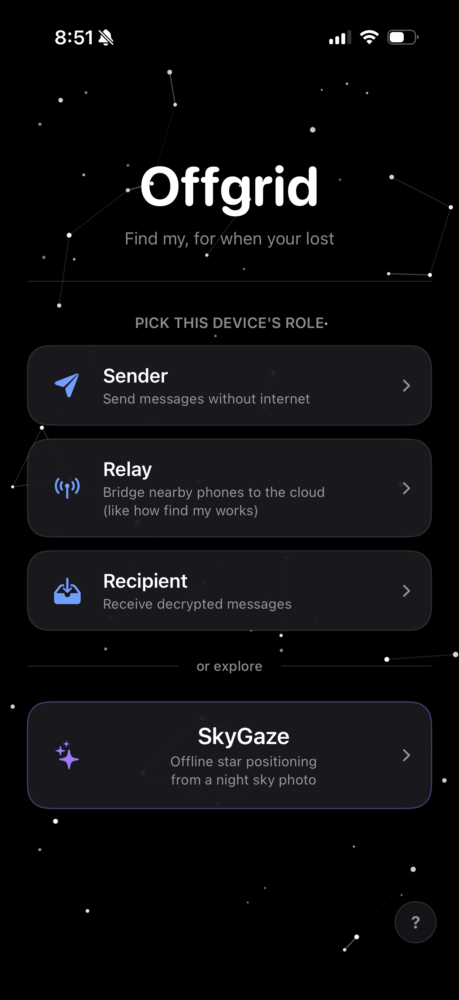<br/>test1</td>
    <td align="center">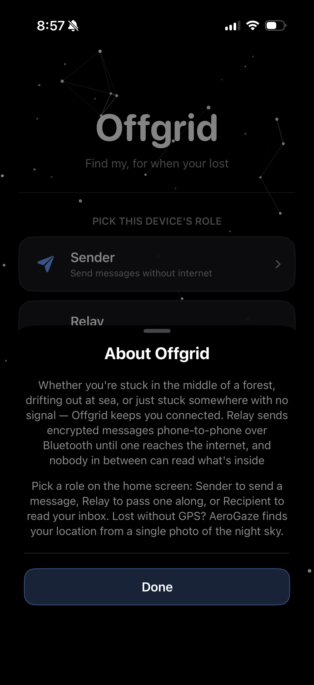<br/>test1</td>
    <td align="center">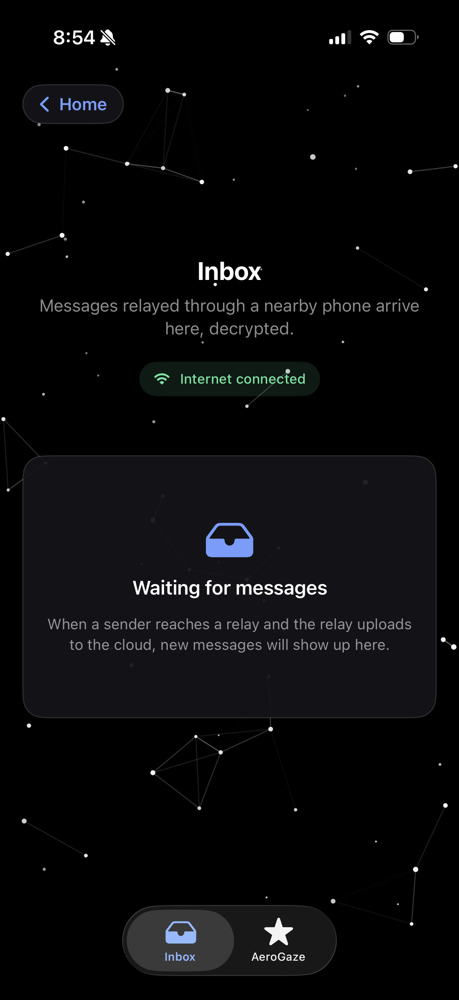<br/>test1</td>
  </tr>
  <tr>
    <td align="center">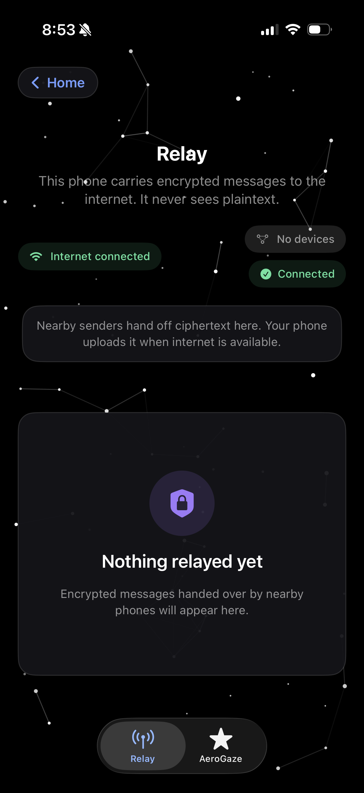<br/>test1</td>
    <td align="center">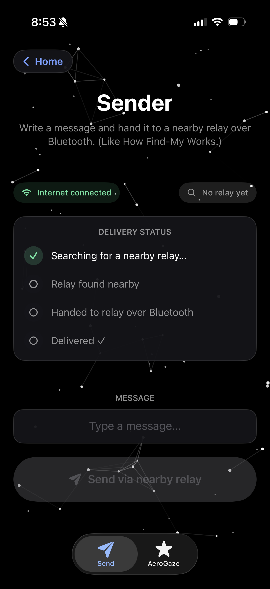<br/>test1</td>
    <td align="center">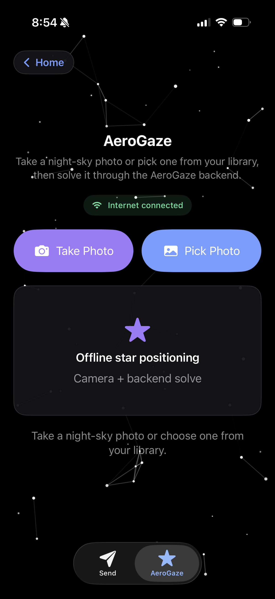<br/>test1</td>
  </tr>
  <tr>
    <td align="center">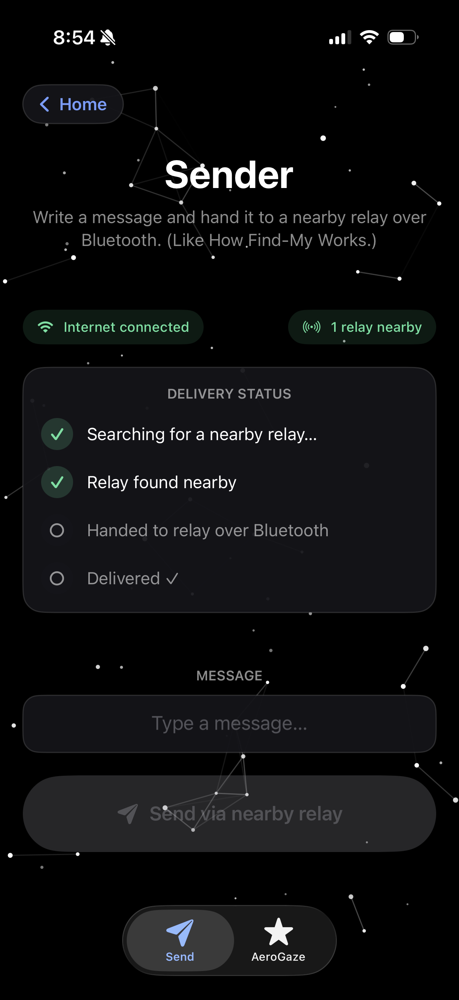<br/>test1</td>
    <td align="center">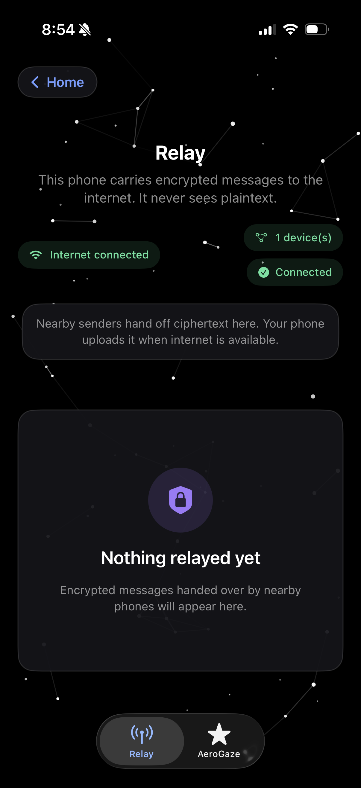<br/>test1</td>
    <td align="center">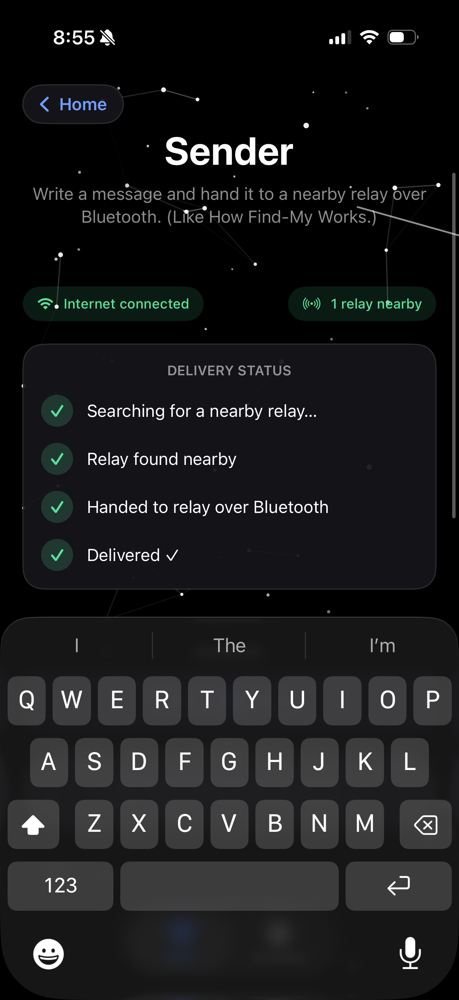<br/>test1</td>
  </tr>
  <tr>
    <td align="center">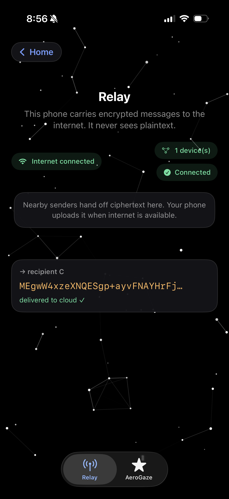<br/>test1</td>
    <td align="center">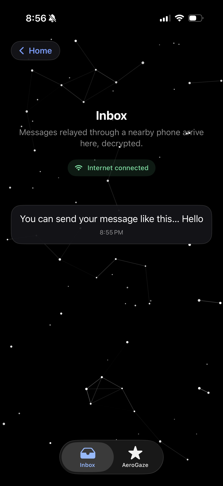<br/>test1</td>
    <td></td>
  </tr>
</table>

</div>

---

This repo has two separate, offline-first tools that deal with that, but to run it you can simply open either the android-app/ or the ios-app/ folder:

1. **AeroGaze** - Finds your exact latitude and longitude (coordinates) from a single photo of the night sky (uses stars/constellations), your phone's gravity sensor, and the current time. No GPS, no cell service, no Wi-Fi.
2. **Relay** — end-to-end encrypted messaging that hands your message to a nearby stranger's phone over Bluetooth/Wi-Fi Direct, which passes it on to the internet once it's back in range. All it ever sees is unreadable ciphertext.

---

## Project Structure

```
Offgrid/
├── aerogaze/          # Core celestial positioning engine (pure NumPy/SciPy)
├── android/           # Standalone Android app — Relay only
├── android-app/       # Unified Android app — AeroGaze (via Chaquopy) + Relay
├── ios/               # iOS app — Relay only (Swift, MultipeerConnectivity)
├── ios-app/           # Unified iOS app — AeroGaze (via Chaquopy) + Relay
├── server/              # Lightweight Python HTTP server for Relay
├── scripts/             # Demo & utility scripts (e.g. demo.py)
├── data/                  # Star catalogs + prebuilt quad-hash indices
├── quad/                 # Standalone quad-based star detection/solving utilities
├── tests/                 # pytest suite for the AeroGaze engine
└── requirements.txt
```


---

## 1. AeroGaze — Offline Celestial Positioning

AeroGaze basically uses star tracking, mixed with astronomical coordinate correction, to find your position from a night-sky photo with zero network dependency.

### How it works
1. **Capture** — take a photo of the night sky.
2. **Detect** — find the stars in the photo (`detect.py`).
3. **Pattern match** — group stars into "quads" and match them against a star catalog (`quadmobile.py` / `solve.py`).
4. **Attitude solver** — figure out which way the camera was pointing (`geometry.py`).
5. **Precession Correction** — adjust for how the stars have shifted since the catalog was made (`astro_lite.py`).
6. **Get your location** — combine that with the phone's gravity sensor to work out latitude and longitude.

---
## 2. Relay — Zero-Signal E2E Encrypted Messaging

Relay is basically Find My, but for messages. You send something with zero signal and your phone hands it to a nearby stranger's phone, which carries it along until it gets internet, without ever being able to read what's inside.

### How it works
1. **Handoff** — your phone finds a nearby device over Bluetooth/Wi-Fi Direct and hands it the encrypted message.
2. **Carry** — that phone (the "relay") holds onto it, but it can't decrypt it, so it's just carrying ciphertext.
3. **Upload** — once the relay phone has internet, it POSTs the message to the server.
4. **Deliver** — the recipient polls the server, pulls down anything queued for them, and decrypts it locally.

---


## Running the app

### Android Version
**Prerequisites:**
- Android Studio (Ladybug / 2024.2+), JDK 17
- Python 3.12 installed on the build machine (required by Chaquopy)
- A physical Android device (minSdk 26) with camera + accelerometer for real solves — emulator works for Demo Mode only

**Steps:**
1. Open `android-app/` in Android Studio.
2. Set Gradle JDK to 17 (Settings -> Build Tools -> Gradle -> Gradle JDK).
3. Let Gradle sync — this downloads dependencies automatically.
4. Run on an `x86_64` emulator (Demo Mode) or an `arm64-v8a` physical device (Live Capture).


### iOS Version

**iOS (`ios-app/`):**
1. Open `ios-app/` in Xcode.
2. Configure the required Bluetooth/Local Network keys in `Info.plist` (see `ios-app/INFO-PLIST-KEYS.md`).
3. In `AppModel.swift`, set:
   ```swift
   private let serverURL = URL(string: "http://<laptop-LAN-IP>:8080")!
   ```
4. Build and run on a **physical iOS device** — emulators don't support the required Bluetooth features.

---

## Starting the Relay Server

For testing pourposes to run the server you need 3 devices, 2 external (phones), and the third can be you computer. once all 3 are running, you will need to open your terminal on your computer and run this command for the relay server

### MAC (Terminal)

To run the relay server on your Macs:

```bash
python3 -m venv .venv
source .venv/bin/activate
pip install -r requirements.txt
nohup ./.venv/bin/python3 server/server.py > /tmp/offgrid-server.log 2>&1 &
```

After that, if you want to start it again later, you can run:

```bash
python3 server/server.py
```

---
